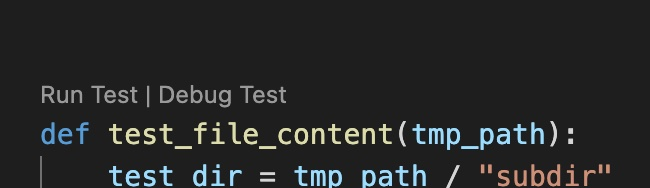

Setup the Dev Environment
=========================

Setup a virtual environment for python
--------------------------------------

First install virtualenv:

I follow the routes in the flask tutorial https://www.tutorialspoint.com/flask/flask_environment.htm

.. code-block:: sh

    pip install virtualenv

No go to your project folder and type in

.. code-block:: sh

    virtualenv venv

This will create a ``venv`` folder. Now type in:

.. code-block:: sh

    source venv/bin/activate

You should now see ``venv`` in front of your cli prompt.

If you want to exit from the virtual environment then
type ``deactivate`` at the prompt.

Create a separate virtual environment for windows
-------------------------------------------------

If you want to use a virtual environment for windows
then you can create a separate virtual environment for windows.

Use the command ``pip install virtualenv``.

Now go to your project folder and type in, but
do **not** use ``venv`` but a different fodername
for this separate virtual environment
(especially when working in a dropbox folder).

.. code-block:: sh

        virtualenv venv_win

This will create a virtual environment that you can use on your windows system.
Before you are able to activate the environment you might have
to change the policy settings so that you can start the skripts.

Use the following command:

.. code-block:: sh

    Set-ExecutionPolicy -Scope CurrentUser -ExecutionPolicy RemoteSigned

Use ``Get-ExecutionPolicy`` to check the policy settings.

You have to activate the virtual environment by typing
in ``venv_win/Scripts/activate.ps1``. You should now see the modified prompt.

psioniq Extension
-----------------

Load the psioniq Extension for VSCode and add the following
configuration. To the ``settings.json`` in ``.vscode`` folder.

.. code-block:: JSON

  {
    "psi-header.config": {
        "license": "MIT",
    "author": "Dr. Rupert Rebentisch"
    },
    "psi-header.templates": [
        {"language": "*",
            "template": [
                "<<filename>>",
                "Copyright (c) <<year>> <<author>>",
                "Licensed under the MIT license"
            ],
            "changeLogCaption": "HISTORY:"
        }
    ],
    "psi-header.lang-config": [
        {"language": "python",
        "begin": "",
        "prefix": "# ",
        "end": ""
        }
    ]
    }

Enable the Debugger
-------------------

In VS Code there are two debuggers.
There is the pdb command line debugger which
is accessible via the terminal and the VS-Code own debugger that is integrated
in the environment.

You have a special view for running tests and debugging them.

.. image:: images/Lab2.jpg

You also can run and start individual tests from the source file.

For this to work the setting of the debugger
and the test engine have to be in sync.

Start the detection of tests with
``Python: Discover Tests`` from the command palette.
Specify ``tests`` as the test directory.

For more information look at the `VSCode Documentation <https://code.visualstudio.com/docs/python/testing>`_

Install the module locally
--------------------------

Go to the project folder where you find the ``setup.py`` file.
Activate the virtual environment. To install the module locally type in:

.. code-block:: sh

    pip install --editable .

With the ``--editable`` flag or ``-e`` flag
the module will be installed in the virtual environment.

You can uninstall the module with:

.. code-block:: sh

    pip uninstall -y tools4zettelkasten

You should now be able to start the module
with ``tools4zettelkasten``.

Install twine
--------------

.. code-block:: sh

        pip install twine

